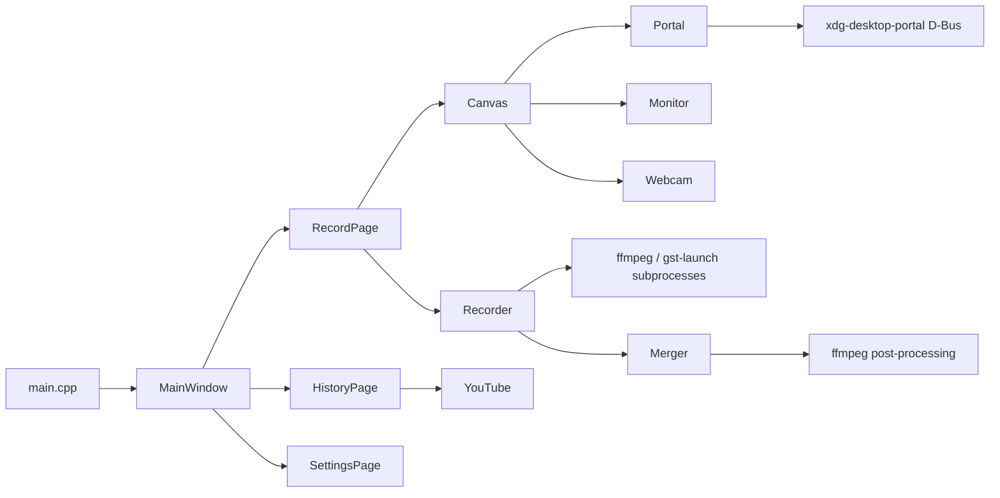

<!-- SPDX-FileCopyrightText: Tim Sutton -->
<!-- SPDX-License-Identifier: MIT -->

# Architecture

A bird's-eye view of the modules that make Kartoza Screencaster tick.

## Layout

```
src/
├── main.cpp                     Application entry, QApplication setup
├── gui/
│   ├── mainwindow.cpp           Top-level window with tab navigation
│   ├── recordpage.cpp           Record tab — wraps the canvas + controls
│   ├── canvas.cpp               WYSIWYG canvas (paint / drag / preview)
│   ├── historypage.cpp          History tab — recording browser
│   ├── settingspage.cpp         Settings tab
│   ├── processingpage.cpp       Post-recording progress page
│   ├── assetgallery.cpp         Reusable asset picker
│   └── tray.cpp                 System tray integration
├── recorder/
│   └── recorder.cpp             ffmpeg + gst-launch subprocess orchestration
├── merger/
│   └── merger.cpp               ffmpeg post-processing pipeline
├── monitor/
│   └── monitor.cpp              Display enumeration (xrandr / Qt / Hyprland / Sway / COSMIC)
├── webcam/
│   └── webcam.cpp               Webcam preview capture
├── platform/
│   └── platform.cpp             OS / display server / compositor detection
├── portal/
│   └── portal.cpp               xdg-desktop-portal QtDBus wrapper (Linux only)
├── dbus/
│   └── dbusservice.cpp          Session-bus service for global shortcuts (Linux only)
├── config/
│   └── config.cpp               QSettings-backed persistent state
└── youtube/
    └── youtube.cpp              YouTube OAuth + Upload API client
```

## Runtime flow



## Threading

- The GUI runs on the main Qt thread.
- Subprocesses (`ffmpeg`, `gst-launch`) run as `QProcess` children
  with stderr piped back to the main thread for logging.
- Merger post-processing runs on a worker thread; progress is
  reported via signals.
- Canvas preview capture runs on the Qt thread pool — each frame
  request is one task.
