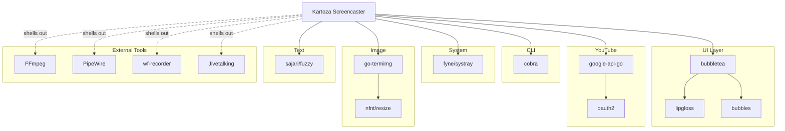

# Libraries

This document describes the third-party libraries and external tools used in Kartoza Screencaster and the rationale for their selection.

## Core Libraries

### Bubble Tea

<div class="feature-card" markdown>
**[github.com/charmbracelet/bubbletea](https://github.com/charmbracelet/bubbletea)**

The Elm Architecture for terminal applications.
</div>

**Version:** v1.3.10

**Purpose:** Foundation for the entire TUI

**Why chosen:**

- Elm Architecture provides predictable state management
- Excellent performance and low memory usage
- Active development and community
- Works well with other Charm libraries

**Usage:**

```go
type Model interface {
    Init() tea.Cmd
    Update(tea.Msg) (tea.Model, tea.Cmd)
    View() string
}
```

---

### Lip Gloss

<div class="feature-card" markdown>
**[github.com/charmbracelet/lipgloss](https://github.com/charmbracelet/lipgloss)**

Style definitions for terminal UIs.
</div>

**Version:** v1.1.1

**Purpose:** Consistent styling and layout

**Why chosen:**

- Declarative styling API
- Flexbox-like layout
- Color support with degradation
- Integrates seamlessly with Bubble Tea

**Usage:**

```go
style := lipgloss.NewStyle().
    Bold(true).
    Foreground(lipgloss.Color("#FF9500")).
    Padding(1, 2)

rendered := style.Render("Hello, World!")
```

---

### Bubbles

<div class="feature-card" markdown>
**[github.com/charmbracelet/bubbles](https://github.com/charmbracelet/bubbles)**

Common UI components for Bubble Tea.
</div>

**Version:** v0.21.1

**Purpose:** Reusable UI widgets

**Components used:**

| Component | Usage |
|-----------|-------|
| `textinput` | Title, description inputs |
| `textarea` | Multi-line description |
| `spinner` | Loading indicators |
| `progress` | Upload/processing bars |
| `key` | Keyboard handling |
| `table` | Recording history |
| `viewport` | Scrollable content areas |

---

## System Tray

### Fyne Systray

<div class="feature-card" markdown>
**[fyne.io/systray](https://github.com/fyne-io/systray)**

Cross-platform system tray library.
</div>

**Version:** v1.12.0

**Purpose:** System tray icon and menu for quick recording access

**Why chosen:**

- Cross-platform (Linux, macOS, Windows)
- Simple API
- No CGO required on most platforms
- Active maintenance

---

## Image Processing

### Go Terminal Image

<div class="feature-card" markdown>
**[github.com/blacktop/go-termimg](https://github.com/blacktop/go-termimg)**

Display images in terminal emulators.
</div>

**Version:** v0.1.24

**Purpose:** Display webcam preview and thumbnails in the TUI

**Why chosen:**

- Supports multiple terminal image protocols (Sixel, iTerm2, Kitty)
- Automatic protocol detection
- Fallback to ASCII art

---

### Resize

<div class="feature-card" markdown>
**[github.com/nfnt/resize](https://github.com/nfnt/resize)**

Pure Go image resizing.
</div>

**Version:** v0.0.0-20180221191011-83c6a9932646

**Purpose:** Resize images for thumbnails and overlays

**Why chosen:**

- Pure Go (no CGO)
- Multiple resize algorithms (Lanczos, Bicubic, etc.)
- Simple API

---

## Text Processing

### Fuzzy

<div class="feature-card" markdown>
**[github.com/sajari/fuzzy](https://github.com/sajari/fuzzy)**

Fuzzy string matching and spell checking.
</div>

**Version:** v1.0.0

**Purpose:** Spell checking for video titles and descriptions

**Why chosen:**

- Fast fuzzy matching
- Customizable word lists
- Pure Go implementation

---

## YouTube Integration

### Google APIs

<div class="feature-card" markdown>
**[google.golang.org/api](https://pkg.go.dev/google.golang.org/api)**

Official Google API client libraries.
</div>

**Version:** v0.260.0

**Packages used:**

- `youtube/v3` - YouTube Data API
- `oauth2` - Authentication

**Purpose:** YouTube upload and playlist management

**Usage:**

```go
import "google.golang.org/api/youtube/v3"

service, err := youtube.NewService(ctx, option.WithHTTPClient(client))
call := service.Videos.Insert([]string{"snippet", "status"}, video)
response, err := call.Media(file).Do()
```

---

### OAuth2

<div class="feature-card" markdown>
**[golang.org/x/oauth2](https://pkg.go.dev/golang.org/x/oauth2)**

OAuth 2.0 client implementation.
</div>

**Version:** v0.34.0

**Purpose:** Google authentication

**Features used:**

- Authorization code flow
- Token refresh
- Secure token storage

---

## CLI Framework

### Cobra

<div class="feature-card" markdown>
**[github.com/spf13/cobra](https://github.com/spf13/cobra)**

CLI application framework.
</div>

**Version:** v1.10.2

**Purpose:** Command-line argument parsing

**Why chosen:**

- Industry standard for Go CLIs
- Automatic help generation
- Subcommand support
- Shell completion

**Usage:**

```go
var rootCmd = &cobra.Command{
    Use:   "kvp",
    Short: "Kartoza Screencaster",
    Run:   runApp,
}
```

---

## External Tools

These external command-line tools are used by Kartoza Screencaster for media processing:

### FFmpeg

<div class="feature-card" markdown>
**[ffmpeg.org](https://ffmpeg.org/)**

Complete, cross-platform solution for recording, converting, and streaming audio and video.
</div>

**Purpose:** Video/audio encoding, merging, and filter processing

**Features used:**

- Screen recording (`x11grab`, `avfoundation`, `gdigrab`)
- Video encoding (H.264/libx264)
- Audio encoding (AAC, PCM)
- Video filters (scale, crop, overlay, drawtext)
- Audio filters (loudnorm, pan)
- Concatenation of video parts

**License:** LGPL/GPL

---

### PipeWire (Linux)

<div class="feature-card" markdown>
**[pipewire.org](https://pipewire.org/)**

Low-latency audio/video server for Linux.
</div>

**Purpose:** Audio recording on Linux

**Tools used:**

- `pw-record` - Audio capture
- `pw-cli` - Device enumeration

**Why chosen:**

- Modern replacement for PulseAudio
- Lower latency
- Better integration with Wayland

**License:** MIT

---

### wf-recorder (Linux/Wayland)

<div class="feature-card" markdown>
**[github.com/ammen99/wf-recorder](https://github.com/ammen99/wf-recorder)**

Screen recorder for wlroots-based Wayland compositors.
</div>

**Purpose:** Screen recording on Wayland

**Why chosen:**

- Native Wayland support
- Hardware encoding support
- Compositor-agnostic

**License:** MIT

---

### Jivetalking

<div class="feature-card" markdown>
**[github.com/linuxmatters/jivetalking](https://github.com/linuxmatters/jivetalking)**

Professional audio processing tool for podcast and screencast production.
</div>

**Purpose:** Advanced audio processing (when installed)

**Features used:**

- Multi-pass audio analysis
- Adaptive noise removal (anlmdn + compand)
- LA-2A style optical compression
- DS201-inspired gating
- De-essing
- EBU R128 loudness normalization

**Processing pipeline:**

1. **Pass 1:** Analysis (loudness, noise floor, speech characteristics)
2. **Pass 2:** Processing (high-pass, noise removal, gate, compression, de-esser)
3. **Pass 3:** Loudnorm measurement
4. **Pass 4:** Loudnorm application + click repair

**Fallback:** When jivetalking is not installed, Kartoza Screencaster falls back to basic FFmpeg loudnorm processing.

**License:** GPL-3.0

---

## Dependency Graph



## Version Management

### go.mod

All Go dependencies are managed through Go modules:

```go
module github.com/kartoza/kartoza-screencaster

go 1.24

require (
    fyne.io/systray v1.12.0
    github.com/blacktop/go-termimg v0.1.24
    github.com/charmbracelet/bubbles v0.21.1
    github.com/charmbracelet/bubbletea v1.3.10
    github.com/charmbracelet/lipgloss v1.1.1
    github.com/nfnt/resize v0.0.0-20180221191011-83c6a9932646
    github.com/sajari/fuzzy v1.0.0
    github.com/spf13/cobra v1.10.2
    golang.org/x/oauth2 v0.34.0
    google.golang.org/api v0.260.0
)
```

### Updating Dependencies

```bash
# Update all
go get -u ./...

# Update specific library
go get -u github.com/charmbracelet/bubbletea

# Check for updates
go list -m -u all

# Tidy dependencies
go mod tidy
```

## Selection Criteria

When choosing libraries, we consider:

1. **Maintenance** - Active development, responsive maintainers
2. **Community** - Usage, documentation, examples
3. **Performance** - Memory usage, CPU efficiency
4. **API stability** - Semantic versioning, deprecation policy
5. **License** - MIT, Apache 2.0, or similar permissive license
6. **Size** - Minimal dependencies, reasonable binary size

## Alternatives Considered

### TUI Framework

| Library | Consideration | Decision |
|---------|---------------|----------|
| **Bubble Tea** | Elm architecture, excellent ecosystem | **Selected** |
| tview | More traditional, harder to test | Not selected |
| termui | Good for dashboards, less flexible | Not selected |
| tcell | Lower level, more boilerplate | Not selected |

### CLI Framework

| Library | Consideration | Decision |
|---------|---------------|----------|
| **Cobra** | Industry standard, full featured | **Selected** |
| urfave/cli | Good but less ecosystem | Not selected |
| kong | Nice API but newer | Not selected |

### Audio Processing

| Tool | Consideration | Decision |
|------|---------------|----------|
| **Jivetalking** | Professional multi-pass processing, adaptive | **Primary (if installed)** |
| FFmpeg loudnorm | Basic two-pass normalization | **Fallback** |
| SoX | Good but less flexible filters | Not selected |

## License Summary

### Go Libraries

| Library | License |
|---------|---------|
| bubbletea | MIT |
| lipgloss | MIT |
| bubbles | MIT |
| fyne/systray | BSD-3-Clause |
| go-termimg | MIT |
| nfnt/resize | ISC |
| sajari/fuzzy | MIT |
| cobra | Apache 2.0 |
| google-api-go | BSD-3-Clause |
| oauth2 | BSD-3-Clause |

### External Tools

| Tool | License |
|------|---------|
| FFmpeg | LGPL/GPL |
| PipeWire | MIT |
| wf-recorder | MIT |
| Jivetalking | GPL-3.0 |

All Go dependencies use permissive open-source licenses compatible with the project's MIT license. External tools are called via subprocess and their licenses apply independently.
